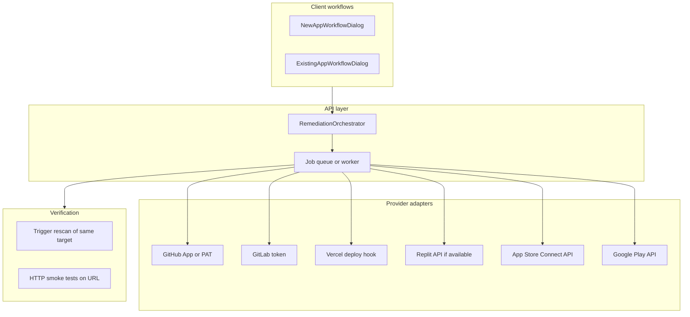

# Real-world post-scan fix, deploy, and verify (all scan types)

## Current baseline (what exists today)

- **Apply fixes**: [`applyFixesForScan`](00_Full_Source_Code/server/routes.ts) updates **findings** in Postgres via `markFindingsAsFixed`—it does **not** modify customer repos, hosts, or binaries.
- **Upload**: `POST /api/{mvp|mobile|web}-scans/:id/upload` updates `uploadStatus` / `uploadProgress` with **simulated** `setTimeout` stages (see e.g. web upload block ~2356–2412 in [`routes.ts`](00_Full_Source_Code/server/routes.ts)).
- **Schema** already has hooks for real tracking: `fixesApplied`, `uploadPreference`, `validationStatus`, `workflowMetadata`, app store fields on MVP/mobile ([`shared/schema.ts`](00_Full_Source_Code/shared/schema.ts)).
- **New App vs Existing App**: Same backend routes and scan rows; only the **dialog UI** differs. Any “real fix” work is implemented **once** per scan type and reused by both workflows.

---

## Product vision (PRD summary)

**Problem**: Users interpret “Upload with fixes” as **pushing patched code** and **publishing** to their environment (Replit/Vercel/App Store). Today the product only **models** that journey in the database.

**Goal**: For each scan type, define a **truthful** remediation path: where code lives, how patches land, how deploy happens, how we **verify** the fix (re-scan, smoke test, CI status).

**Non-goals (initial phases)**:

- Fully automated patching of **arbitrary** customer infra without OAuth/consent.
- Guaranteed App Store review or production release without human approval.
- Patching a **live site** with no access to its **source** (must be explicit: link repo, or PR-only / manual apply).

**Success metrics (examples)**:

- % of MVP flows where a **PR or branch** is created successfully.
- Time from “apply fix” to **green CI** or **passed verification scan**.
- User-visible **failure reasons** (auth, merge conflict, deploy failed) instead of silent success.

---

## Why the three scan types need different architectures

| Scan type      | What we analyze             | Realistic “fix” surface                                                                              | Realistic “deploy”                                       |
| -------------- | --------------------------- | ---------------------------------------------------------------------------------------------------- | -------------------------------------------------------- |
| **MVP (repo)** | Git clone + static analysis | Commit/PR to **same repo** (user grants access)                                                      | CI/CD from that repo (GitHub Actions, Vercel, etc.)      |
| **Web (URL)**  | Live URL crawl/DAST         | **No source** unless user links a repo; fixes are either **PR to linked repo** or **exported patch** | Redeploy from CI or host webhook after merge             |
| **Mobile**     | Package/binary analysis     | **Not** a normal git flow; fixes are **source repo** (if linked), or **Fastlane** + store upload     | TestFlight / Play internal track / store submission APIs |

**Important**: “Web app scan” does not magically edit production HTML on the server. Real remediation always goes through **source control + build + deploy** (or manual apply).

---

## Target architecture (high level)

**Core concepts**:

1. **Remediation job** (new table or reuse `workflowMetadata` + status): `pending | patching | pr_opened | deploying | verifying | succeeded | failed`, with structured `error` and `externalIds` (PR URL, deployment ID).
2. **Credential model**: Per-user or per-organization **OAuth apps** / **PATs** with least privilege (repo contents, workflows, deploy hooks)—stored encrypted ([`auth`](00_Full_Source_Code/server/auth.ts) patterns, new secrets table).
3. **Patch generation**: Today findings have suggested fixes in UI; orchestrator turns selected findings into **unified diff** or **Copilot-style patch** (existing OpenAI usage in project can feed this)—still requires human/PR review for production.
4. **Deploy**: Not “upload” in-process—**trigger** external pipeline (GitHub `repository_dispatch`, Vercel deploy hook, etc.).
5. **Verify**: Re-run [`scanWebApp`](00_Full_Source_Code/server/services/webScanService.ts) / [`scanMvpCode`](00_Full_Source_Code/server/services/mvpScanService.ts) on the **post-merge URL** or branch preview URL; compare finding counts.

---

## Workflows by scan type (product behavior)

### A. MVP code (Git repo)

**User story**: After scan, user chooses “Apply fixes” → system opens a **branch + PR** with automated patches; merge triggers their CI; optional “Verify” re-scans.

**Flow**:

1. User connects **GitHub/GitLab** (OAuth).
2. Orchestrator clones (already similar to [`cloneRepository`](00_Full_Source_Code/server/services/mvpScanService.ts)), applies patches to **tracked files**, runs formatter/tests in **sandbox**, pushes branch, opens PR.
3. “Deploy” = user’s existing CI; optional webhook marks job `deployed` when CI passes.
4. **New App / Existing**: Identical API; UI may pre-fill `repositoryUrl` / branch from workflow.

**Routes (conceptual)**:

- `POST /api/mvp-scans/:id/remediation/start` (body: finding IDs, strategy).
- `GET /api/mvp-scans/:id/remediation/status`.
- Webhook `POST /api/integrations/github` for PR merged / CI status.

---

### B. Web (live URL)

**User story**: DAST finds issues; user wants fixes in **code**. Require **linked Git repo** (already optional in [`workflowMetadata`](00_Full_Source_Code/shared/schema.ts) / New App web advanced) OR explicit “no repo—export patch only.”

**Flow**:

1. If **repo linked**: same as MVP PR flow targeting that repo; deploy via their pipeline; **re-scan live URL** after deploy URL is known (or preview URL from Vercel).
2. If **no repo**: generate **patch file / instructions** only; **no** claim of “uploaded to website.”
3. **New App / Existing**: Same; enforce UI copy when repo missing.

---

### C. Mobile (iOS/Android)

**User story**: Fixes land in **mobile source repo** (if connected); **binary** upload to TestFlight/Play is a **separate** gated step (Fastlane, API keys, compliance).

**Flow**:

1. Link **source repo** (optional field expansion in `workflowMetadata` or dedicated columns).
2. PR with code fixes (same Git orchestrator as MVP where applicable).
3. Optional phase: **Fastlane** job queued with user-provided secrets (App Store Connect API key, etc.)—high compliance bar; often **manual** release in v1.

**New App / Existing**: Same backend; mobile workflow may emphasize “connect repo for code fixes” vs “store upload is separate.”

---

## Phased delivery (recommended)

| Phase | Scope                                 | Outcome                                                                |
| ----- | ------------------------------------- | ---------------------------------------------------------------------- |
| **0** | Product honesty                       | UI + API responses distinguish **simulated** vs **real**; docs in-app. |
| **1** | **Git PR path (MVP + web-with-repo)** | OAuth, branch/PR, job status, failure messages.                        |
| **2** | **Verify**                            | Auto re-scan / smoke test after PR merge or deploy hook.               |
| **3** | **Deploy hooks**                      | Vercel/Netlify/GitHub Actions dispatch.                                |
| **4** | **Mobile**                            | Repo-based PR first; store pipelines later.                            |

---

## PRD-style requirements (condensed)

**Must have (Phase 1)**:

- User can **connect** at least one Git provider.
- “Apply fixes” creates **auditable** output (PR URL), not only DB status.
- Idempotent jobs; clear **failure** states.

**Should have (Phase 2–3)**:

- Webhook-driven status; **re-scan** verification job.
- Mapping `hostingPlatform` ([`webAppScans.hostingPlatform`](00_Full_Source_Code/shared/schema.ts)) to **concrete** deploy hook strategies.

**Could have (Phase 4)**:

- App Store / Play automation with legal and secret management.

**Risks**:

- Secrets handling, OAuth review, rate limits, merge conflicts, customer CI variance.

---

## Files likely to change (when implementing)

- [`server/routes.ts`](00_Full_Source_Code/server/routes.ts): Replace or gate simulated upload; add remediation routes; wire webhooks.
- [`shared/schema.ts`](00_Full_Source_Code/shared/schema.ts): `remediation_jobs` or extend scan rows with external correlation IDs.
- New: `server/remediation/` (orchestrator, Git adapter, verify service).
- [`client/src/components/NewAppWorkflowDialog.tsx`](00_Full_Source_Code/client/src/components/NewAppWorkflowDialog.tsx) and [`ExistingAppWorkflowDialog.tsx`](00_Full_Source_Code/client/src/components/ExistingAppWorkflowDialog.tsx): Connect-account steps, PR links, honest status—**parallel** UX for both.

---

## Summary

This plan aligns **product promise** with **technical reality**: MVP and web-with-repo converge on **Git + CI**; web-without-repo is **export/manual**; mobile adds **store tooling** in later phases. **New App** and **Existing** workflows share one implementation per scan type—only onboarding copy and defaults differ.
